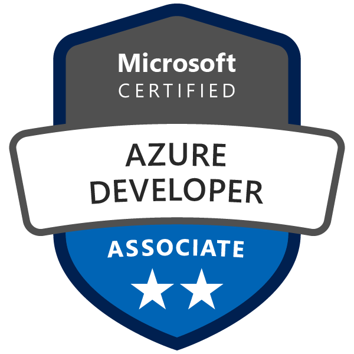
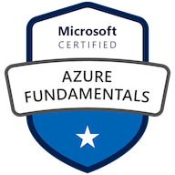
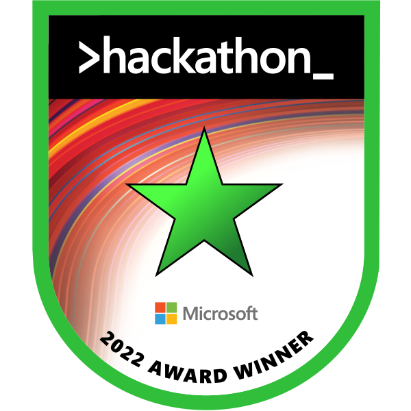

<h1 align="center">Hello World👋, I'm Mars Wang</h1>
<h3 align="center">Purdue University ECE M.S. Student | Software Engineer | <a href="https://medium.com/@mars-wangyang">Technical Blogger</a> | ex-Microsoft Cloud Solution Architect | Adventurer</h3>

### About Me
🎓  I'm currently studying in Electrical and Computer Engineering at Purdue University, West Lafayette.
🌱  I'm on track with learning more about Distributed Systems, Virtualization, and Software Architecture.
🤔 In my free time, I enjoy working-out, listening to the music (R&B or Jazz mostly), and playing video games.
📫 You can drop me an email at marsmang0525@gmail.com 📨 It will be a pleasure to talk with you!.
📄  Check my now page to get to know me a little better.

### Languages

### Cloud Service

### Technologies

 
 
 

### Certificates

    <a href="https://learn.microsoft.com/api/credentials/share/en-us/MarsD-2305/D3BDEF124037DCD1?sharingId=EC3477E1926F0194" target="blank"> 
    <a href="https://www.credly.com/badges/cc24f8eb-c8d6-4115-954f-16700b6082e1/public_url" target="blank"> 
    <a href="https://learn.microsoft.com/api/credentials/share/zh-tw/MarsD-2305/D3BDEF124037DCD1?sharingId=EC3477E1926F0194" target="blank"> 
    <a href="https://www.credly.com/badges/e55aca56-ab49-4e5e-884c-989f4d847397/public_url" target="blank"> 
    <a href="https://www.credly.com/badges/9b461b6f-2342-4dcb-af69-f3df32b59925/public_url" target="blank"> 

<h3 align="left">Connect with me:</h3>

